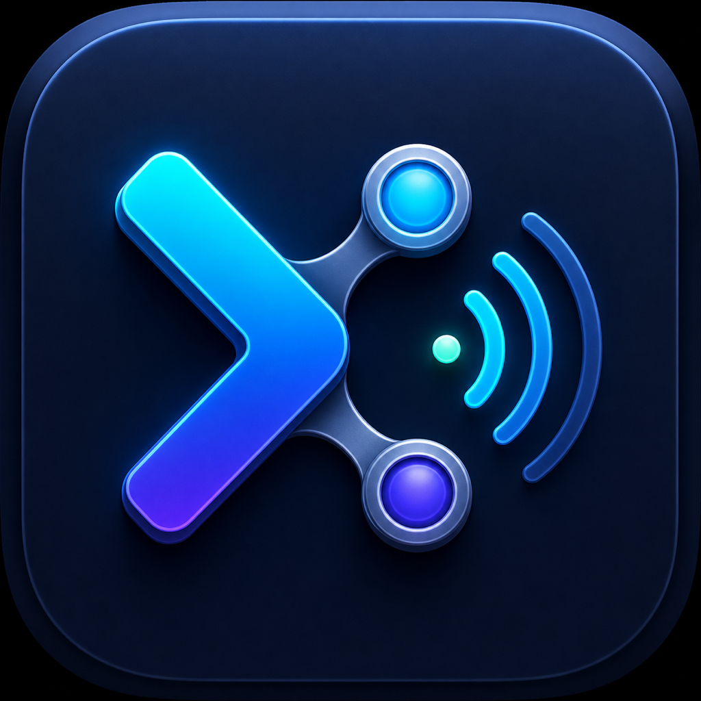

# Codex Remote 第三方模型迁移套件

这套工具用于在 Linux、macOS 和 Windows 上，让 Codex 的**模型推理**走兼容
OpenAI Responses API 的第三方接口，同时保留 Remote 所需的官方 ChatGPT 登录、
workspace、设备配对和消息通道。

> 重要：这不是“完全绕过官方账户”。远控配对、登录和消息传输仍依赖官方
> 服务；提示词、代码、工具定义和工具结果则可能发送到第三方模型供应商。

## 先快速判断

| 当前情况 | 应该怎么做 |
|---|---|
| 第一次安装 | 运行对应平台的在线安装命令，再按中文面板完成安装 |
| macOS 旧版安装曾显示 `add-generic-password` 用法并失败 | **先重新运行在线安装命令刷新工具代码**，再选择 `1`；旧版已自动恢复时不需要先回滚 |
| 已经成功安装，只是升级工具代码 | 重新运行在线安装命令；已有配置和系统凭据保留，不要再次选择“安装第三方 provider” |
| macOS 只需要刷新中文名称或图标 | 更新工具后运行 `codex-rp shortcut`，必要时从 Dock 移除旧入口再重新拖入 |
| macOS 正在使用 CC Switch | 安装或切换本工具第三方前，必须先在 CC Switch 中切回 OpenAI 官方配置 |

macOS 菜单中的每个操作完成或失败后都会回到主菜单；只有选择 `0`、关闭输入或
直接运行单条非菜单命令时，Terminal 才会显示进程结束。不要从旧的 `.app` 入口
直接重试旧版安装逻辑，先用在线安装命令刷新它所指向的工具目录。

## 仓库内容

- `install.sh`：供 `curl | sh` 使用的公开在线安装入口。
- `install-windows.ps1`：供 Windows PowerShell 使用的公开在线安装入口。
- `install-provider.sh`：安装第三方 provider、专用 systemd 服务和安全的密钥文件。
- `install-codex.sh`：检查系统依赖，安装 Codex CLI 并引导 ChatGPT 登录。
- `setup.sh`：一键安装、启动、完整验证，以及统一管理入口。
- `refresh-units.sh`：升级时安全刷新官方/第三方 systemd unit 和全局命令。
- `status.sh`：分层检查服务、配置、模型接口和真实 Codex 调用。
- `use-official.sh`：人工切回默认/官方推理，可能消耗官方额度。
- `use-third-party.sh`：人工切回第三方推理。
- `rollback.sh`：恢复安装前配置并移除持久化密钥。
- `platform/macos/`：macOS Keychain、配置切换和桌面应用管理入口。
- `platform/macos/assets/`：macOS 快捷启动的 1024px 源图、多尺寸 `.icns` 和生成说明。
- `platform/windows/`：Windows DPAPI、PowerShell 配置切换和桌面应用管理入口。
- `docs/OPERATIONS.md`：日常启动、切换、升级和密钥轮换手册。
- `docs/TROUBLESHOOTING.md`：按症状排查手机报错、接口错误和进程冲突。
- `docs/ARCHITECTURE.md`：数据流、边界和回退机制。
- `MIGRATION_PROMPT.md`：复制到其他服务器后可直接交给 Codex 的迁移提示词。
- `current-host/`：仅用于最初已经配置过的源服务器，不用于新服务器安装。

## 安全边界

不要把 API 密钥写进仓库、聊天、命令行参数或 `config.toml`。Linux 将密钥写入
root-only `EnvironmentFile`；macOS 存入当前用户 Keychain；Windows 使用当前用户
DPAPI 加密。桌面平台通过 Codex 官方支持的 provider `auth.command` 在需要时读取
密钥。请只使用可信供应商，并假设第三方能够看到模型调用中发送的内容。

如果密钥曾经发到聊天、日志、终端截图或工单中，应立即在供应商后台吊销并
生成新密钥。私有仓库也不能替代密钥轮换。

## 平台支持

| 平台 | Remote 宿主 | 凭据存储 | 后台管理 | CC Switch/外部 provider 防覆盖 |
|---|---|---|---|---|
| Linux/systemd | Codex Remote CLI daemon | root-only EnvironmentFile | 两个互斥 systemd unit | 尚未提供，不要交替使用 |
| macOS | ChatGPT 桌面应用 | macOS Keychain | 不自动重启应用 | 安装前预检，检测到外部配置时拒绝覆盖 |
| Windows 原生 | ChatGPT 桌面应用 | 当前用户 DPAPI | 不自动重启应用 | 尚未提供，不要交替使用 |

当前只有 macOS 实现了针对 CC Switch 的所有权检查和保护性回滚。Linux、Windows
虽然支持本套件的官方/第三方手动切换，但不能把 macOS 的共存保证外推过去；在这
两个平台上不要让其他 provider 管理工具与本套件交替修改同一份 Codex 配置。

macOS/Windows 切换默认只原子更新用户级 Codex 配置，不会自动退出或重启 ChatGPT，
因此不会无提示中断 Remote。需要应用新配置时，由用户明确执行 `restart-app`；这会
造成短暂断线，但不会注销账号或删除配对。

若机器还没有 Codex，套件会自动调用 OpenAI 官方安装器。对应的官方独立命令是：

```bash
# macOS / Linux
curl -fsSL https://chatgpt.com/codex/install.sh | sh
```

```powershell
# Windows PowerShell
powershell -ExecutionPolicy ByPass -c "irm https://chatgpt.com/codex/install.ps1 | iex"
```

这些命令只负责 Codex；本套件的一键入口会在此基础上继续安装中文管理面板、
安全凭据读取和第三方 provider 配置。

## 一键命令面板

克隆仓库后直接运行：

```bash
./panel.sh
```

面板统一提供安装、状态检查、完整测试、第三方/官方切换和回滚。首次安装可以
填写第三方 Base URL、模型、Provider ID 和推理强度；Base URL 必须替换为真实
地址，其他项目可直接回车使用默认值。需要系统权限时脚本会自动通过 `sudo`
重新执行，不需要手工拼接命令。macOS 使用当前用户目录和 Keychain，不需要 root。
套件自身的菜单、帮助、进度和错误提示均使用中文；systemd、Codex CLI 与第三方
接口直接返回的字段或日志会保留原文，便于检索和排障。

首次安装完成后会注册全局命令，以后在任意目录直接运行：

```bash
codex-rp
```

从旧版本升级时，在仓库中运行一次新版 `./panel.sh` 即可补装该命令，不需要回滚、
重新安装或重新输入 API 密钥。

Linux 安装会创建第三方 `codex-remote-provider.service` 和官方
`codex-remote-official.service`，并且始终只启用其中一个。首次安装立即启用第三方
模式；退出命令面板不会停止 Remote 后台服务，切换后的模式也会跨系统重启保持。

## Linux 服务器从零安装并运行

前提：使用 systemd 的 Linux 服务器、root/sudo 权限，以及一枚第三方供应商 API
密钥。套件会检查 `curl` 和 Python 3；缺少时会通过 `apt-get`、`dnf` 或 `yum`
安装。若没有兼容的 Codex CLI，则调用 OpenAI 官方独立安装器。

Linux 和 macOS 都可以运行以下公开在线安装命令；脚本会自动识别平台：

```bash
curl -fsSL https://raw.githubusercontent.com/ForceMind/codex-remote-provider-kit/main/install.sh | sh
```

Linux 安装到 `/opt/codex-remote-provider-kit`；macOS 安装到当前用户的
`~/Library/Application Support/CodexRemoteProviderKit/app`。升级时先备份旧目录，
然后打开中文面板。若希望先审查脚本，可以先下载 `install.sh`，阅读后再执行。

推荐直接把本目录旁的压缩包复制到新机器，这样目标机不需要预装 Git：

```bash
scp codex-remote-provider-kit.tar.gz root@SERVER_IP:/root/
ssh root@SERVER_IP
tar -xzf /root/codex-remote-provider-kit.tar.gz
cd codex-remote-provider-kit
./panel.sh
```

如果目标机已经安装 Git，也可以直接克隆：

```bash
git clone https://github.com/ForceMind/codex-remote-provider-kit.git
cd codex-remote-provider-kit
./panel.sh
```

在菜单中选择 `1`。流程会依次执行：

1. 检查并安装系统依赖；
2. 检查 Codex CLI，缺少或不支持 Remote 时运行 OpenAI 官方安装器；
3. 显示网址和设备代码，引导完成 ChatGPT 登录；
4. 询问第三方 Base URL、模型和推理强度；
5. 静默读取第三方 API 密钥；
6. 安装并启动 Remote 服务，然后完成接口和真实 Codex 回合验证。

ChatGPT 登录和第三方 API 密钥是两个独立凭据：前者用于 Remote 配对及连接，
后者用于第三方模型推理。不要把任何密钥放到命令行、仓库或聊天中。

也可以不进入菜单，直接执行同样的完整流程：

```bash
sudo ./setup.sh install
```

直接运行时会要求输入真实的第三方 Base URL；示例地址不能用于安装。

仅安装/检查 Codex CLI 和 ChatGPT 登录：

```bash
sudo ./setup.sh codex
```

`setup.sh install` 会先准备 Codex，再安全地提示输入第三方 API 密钥，然后自动
安装、启动服务，并完成模型目录、Responses 流式接口和真实 Codex 回合三层检查。
密钥输入不会回显。
按回车后脚本会显示已接收的字符数，便于确认粘贴成功，但不会显示密钥内容。
安装器还会把用户级默认 `model_provider`、`model` 和推理强度作为一组设置为
第三方配置；托管 Remote daemon 在创建新会话时会读取这些值。

已经安装过时，再次运行 `sudo ./setup.sh` 不会覆盖初始备份或要求重新输入密钥；
它会刷新新版 unit 与全局命令、切回第三方 Remote，并执行完整检查。

如需覆盖默认参数：

以下 Base URL 仍是格式示例，实际执行时请替换为供应商提供的真实地址。

```bash
sudo ./setup.sh install \
  --base-url https://provider.example/v1 \
  --model gpt-5.5 \
  --reasoning medium
```

安装器会备份重叠配置、校验 TOML、保存原服务状态，并启动独立的
`codex-remote-provider.service`。安装过程按事务处理：若写入后启动服务失败，会
尝试恢复安装前的配置、unit、全局命令和服务状态，并且不会留下“已安装”状态。

第三方 Base URL 默认必须使用 HTTPS。只有隔离的本机测试确实需要 HTTP 时，才可
在命令行安装后附加 `--allow-http`；不要通过公网发送明文 API 密钥。

## macOS 安装与 Remote

<p>
  
</p>

macOS 使用与 Linux 相同的在线入口：

```bash
curl -fsSL https://raw.githubusercontent.com/ForceMind/codex-remote-provider-kit/main/install.sh | sh
```

### 安装、升级与旧版故障恢复

如果上次在输入密钥后看到 `add-generic-password` 的 Usage，旧版安装事务已经恢复
原配置并删除新建的 Keychain 条目。复测时需要重新运行上面的在线安装命令，让
`~/Library/Application Support/CodexRemoteProviderKit/app` 更新到最新版；只运行
旧的 `codex-rp install` 不会更新脚本自身。

第一次安装或旧版安装失败后，按以下顺序操作：

1. 在 CC Switch 中明确切换到 OpenAI 官方配置，并保持 ChatGPT 登录有效。
2. 在中文面板选择 `1`。脚本会先检查官方 provider、ChatGPT 登录和命名冲突。
3. 看到预检通过后输入 `OFFICIAL`；只有这些检查全部通过，才会开始读取第三方密钥。
4. 安装成功或失败后应自动回到主菜单，不需要重新打开 Terminal。
5. 依次选择 `2` 查看状态、`7` 重启 ChatGPT 应用、`3` 完成真实调用测试。
6. 从手机新建会话验证；不要继续使用切换前仍有活跃写入者的会话。

如果只是把已经成功安装的工具升级到最新版，重新运行在线安装命令即可；安装器会
备份并替换程序目录，同时保留独立存放的活动配置和 Keychain 凭据。进入面板后不要
再次选择 `1`，直接运行状态检查或日常操作。

本流程已在 macOS 真机完成端到端验证，包括在线升级、中文菜单、CC Switch 外部
provider 拦截、官方状态安装、Keychain 凭据读取、菜单自动返回和第三方 Remote
实际使用。外部 provider 拦截发生在密钥输入之前，不会覆盖 CC Switch 当前配置。

安装成功后，中文快捷入口应位于
`~/Applications/Codex 远程模型服务工具.app`。如果 Finder 或 Dock 仍显示旧英文名称
或旧图标，先选择菜单 `9`（或运行 `codex-rp shortcut`），再从 Dock 移除旧入口并从
`~/Applications` 重新拖入。

安装过程使用当前桌面用户权限，即使
`~/Library/Application Support/CodexRemoteProviderKit` 尚不存在也不会调用
`sudo`。脚本保持兼容 macOS 系统自带的 Bash 3.2，不需要 Homebrew Bash
或额外 Python 包。

安装器会在缺少 Codex CLI 时调用 OpenAI 官方独立安装器，然后通过中文面板读取
第三方参数。密钥保存在当前用户 Keychain，配置中的 `auth.command` 会调用
`/usr/bin/security` 读取令牌；不会把密钥写入 TOML。

如果已经使用 CC Switch 或其他 Codex provider 管理工具，安装前必须先在该工具中
切换到 OpenAI 官方配置。macOS 安装器会在读取 API 密钥前自动检查：顶层
`model_provider` 只能未设置或为 `openai`，并且 `codex login status` 必须确认使用
ChatGPT 登录；检测到外部 provider 时会直接停止，不覆盖现有配置。交互安装还要求
输入 `OFFICIAL` 确认。Provider ID 或专用 profile 与现有工具冲突时，也会在读取密钥
前停止并要求更换 ID。安装后不要让两个工具同时执行切换。

首次打开面板还会创建
`~/Applications/Codex 远程模型服务工具.app`，可从 Finder 或 Spotlight 直接双击，
也可拖到 Dock。应用使用项目原创的终端箭头/远程连接图标，并内置完整
16–1024 像素 `.icns` 尺寸。它只会打开 Terminal 中的中文管理面板，不会自动切换
provider 或重启 ChatGPT。需要手工刷新快捷入口时运行：

```bash
codex-rp shortcut
```

升级时，旧的受管入口 `Codex Remote Provider Kit.app` 会安全迁移为中文文件名；
同名但不受本套件管理的应用不会被改动。

先在最新版 ChatGPT 桌面应用中登录正确的账号/workspace，并在
`Settings > Connections > Control this Mac` 完成手机配对。安装或切换 provider
不会改变这些状态。切换后明确运行：

```bash
codex-rp restart-app
codex-rp status
codex-rp test
```

`restart-app` 会要求输入确认词，因为重启应用会让 Remote 短暂断开。恢复后请在
手机上新建会话，不要复用切换前仍有活跃写入者的会话。
完整回滚会同时恢复或移除套件管理的 `~/.local/bin/codex-rp`，不会改动
同目录中的其他命令；受管的 `.app` 快捷入口也会同步恢复或移除。
macOS 回滚只撤销本工具拥有的 provider 区块和顶层选择，保留安装后由 CC Switch
新增的其他 provider。若同名 provider 或专用 profile 已被外部工具改写，回滚会
拒绝继续，避免误删外部配置。
每次从官方状态切到本工具第三方前，还会刷新最近一次官方默认值；后续切回官方或
回滚时使用这份最新快照，不会退回安装时已经过时的官方模型选择。

## Windows 原生安装与 Remote

在 PowerShell 中运行公开安装入口：

```powershell
powershell -ExecutionPolicy ByPass -c "irm https://raw.githubusercontent.com/ForceMind/codex-remote-provider-kit/main/install-windows.ps1 | iex"
```

若系统缺少 Codex CLI，工具会调用 OpenAI 官方 Windows 安装器
`https://chatgpt.com/codex/install.ps1`。第三方密钥使用当前 Windows 用户的 DPAPI
加密；provider 通过命令式认证助手按需解密，TOML 中只保存助手和加密文件路径。
安装器兼容 Windows PowerShell 5.1，中文脚本使用带 BOM 的 UTF-8；全局 `.cmd`
启动器只引用同目录 PowerShell 助手，不嵌入可能含中文用户名的绝对路径。升级若在
替换程序、启动器或用户 PATH 时失败，会恢复旧安装和原 PATH。

先在 ChatGPT Windows 应用中登录正确账号/workspace，并在
`Settings > Connections > Control this PC` 完成配对。重新打开终端后使用：

```powershell
codex-rp install -BaseUrl https://provider.example/v1 -Model gpt-5.6-sol
codex-rp restart-app
codex-rp status
codex-rp test
```

WSL2 默认使用另一份 `~/.codex`，不会自动与 Windows 应用共享配置、认证和会话；
需要 WSL 工作流时应明确设置 `CODEX_HOME`，不要同时安装两份套件争用同一配置。

## 验证

以下带 `sudo` 的统一管理入口适用于 Linux；macOS/Windows 使用前述不带 sudo 的
`codex-rp` 命令：

```bash
sudo ./setup.sh status       # 基础检查，不生成模型回复
sudo ./setup.sh test         # 完整真实调用检查
sudo ./setup.sh official     # 人工切回官方推理
sudo ./setup.sh third-party  # 切回第三方推理
sudo ./setup.sh reconfigure  # 修改接口、模型或推理强度
sudo ./setup.sh rotate-key   # 仅更换第三方 API Key
sudo ./setup.sh rollback     # 完整回滚
```

也可以直接调用底层脚本。先做不产生模型回复的基础检查：

```bash
sudo ./status.sh
```

再做完整检查（会产生极少量第三方模型用量）：

```bash
sudo ./status.sh --full
```

官方模式下，即使指定 `--full` 也不会自动生成模型回复，以免意外消耗官方额度；
此时脚本只验证服务、登录状态和安装前默认配置是否已经恢复。

最后在手机上**新建会话**，发送 `Reply exactly OK`。不要让本地 Codex 与手机
同时打开同一个会话；会话存储只允许一个活跃写入者。

新会话的服务器端 `session_meta.model_provider` 应为安装时填写的供应商 ID，模型也应与
安装参数一致。让模型自己回答 provider 不能作为验证依据；应使用服务器元数据
或 `status.sh --full`。

## 回退与恢复

第三方不可用时，人工切到默认/官方推理：

```bash
sudo ./use-official.sh
```

脚本会显示官方额度警告，输入 `y` 确认，输入 `n` 或直接回车取消。恢复第三方：

```bash
sudo ./use-third-party.sh
```

两次切换都会更新 systemd 的开机启用状态，因此服务器重启后仍保持最后一次人工
选择，不会自动从第三方故障转到官方。

完全撤销本套配置：

```bash
sudo ./rollback.sh
```

回滚会将不含密钥的安装状态移动到
`/var/lib/codex-remote-provider/audit/` 作为审计记录，并移除活动状态文件，因此
回滚完成后可以直接重新安装。

本项目刻意不做自动故障转移，因为自动切到官方模型可能产生意外费用。完整
运行方式见 [日常运维](docs/OPERATIONS.md)，报错时见
[故障排查](docs/TROUBLESHOOTING.md)。

## 已知兼容性说明

- Responses 请求的 `input` 必须是数组，并启用 `stream=true`；Codex 的实际请求
  符合这个要求。
- 当前第三方 `/v1/models` 返回 OpenAI 列表格式，但 Codex Remote 的可选模型
  目录刷新可能期待另一个字段，因此日志里可能出现非致命刷新错误。显式配置
  的模型仍可正常调用。
- Codex CLI/Remote 属于会更新的软件。升级后先执行 `status.sh --full`，再让手机
  承担正式工作。
- 当前 unit 使用 `Type=oneshot` 启动 Codex 自身的后台 daemon；systemd 能持久化
  所选模式，但不能直接监督 daemon 的实际 PID。应结合 `status.sh` 做可用性检查。
- OpenAI 官方支持 macOS/Windows 桌面应用作为 Remote 宿主，也支持自定义 provider
  的命令式认证；但官方文档没有承诺每个第三方 Responses 网关都兼容桌面 Remote。
  macOS 当前流程已通过真机验收；Windows 以及后续 Codex/ChatGPT 大版本升级仍需在
  真实设备上重新执行 `status`、`test` 和手机新会话验证。

## 官方参考

- [Codex CLI](https://developers.openai.com/codex/cli/)
- [Codex 配置参考](https://learn.chatgpt.com/docs/config-file/config-reference)
- [Remote connections](https://learn.chatgpt.com/docs/remote-connections)
- [Windows 桌面应用](https://learn.chatgpt.com/docs/windows/windows-app)

## 许可证

本项目采用 [MIT License](LICENSE)。第三方服务、Codex、ChatGPT 及其各自依赖仍受
对应供应商条款约束。
